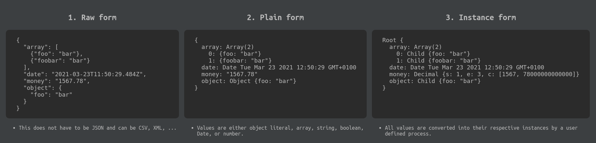

# Conversion

Decoverto converts data between the following three forms:



The process of converting between the raw form and the plain form is handled by either, the default JSON parser, or the [parser defined by the user](./parser.md).

To start conversion, first you need a `Decoverto` instance. Create one using `new Decoverto()`. The next step is to create a type handler for the type you're trying to convert. A type handler can be created by calling `.type(YourType)` on the Decoverto instance.

Example:

```typescript
import {Decoverto, model, property} from 'decoverto';

@model()
class MyDataClass {
    @property()
    prop1: number;

    @property()
    prop2: string;
}

const decoverto = new Decoverto();
const typeHandler = decoverto.type(MyDataClass);

const instance = new MyDataClass();

const plain = typeHandler.instanceToPlain(instance);
const instance2 = typeHandler.plainToInstance({
    prop1: 10,
    prop2: 'string',
});
const instance3 = typeHandler.rawToInstance('{"prop1": 10, "prop2": "string"}');

instance2 instanceof MyDataClass; // true
```

## TypeHandler methods
A list of all conversion methods on `TypeHandler`. For all conversion to and from `Raw`, the JSON parser is assumed.


**rawToInstance(string)**  
Converts a raw value to an instance of RootType.

```TypeScript
typeHandler.parse('{"bar": "foo"}');
decoverto.type(String).parse('"foo"');
```

**rawToInstanceArray(string)**  
Converts a raw value to an array of RootType instances.

```TypeScript
decoverto.type(String).rawToInstanceArray('["foo", "bar"]');
```

**rawToInstanceSet(string)**  
Converts a raw value to a set of RootType instances.

```TypeScript
decoverto.type(String).rawToInstanceSet('["foo", "bar"]');
```

**plainToInstance(object)**  
Converts the plain form of RootType to an instance.

```TypeScript
typeHandler.toInstance({foo: 'bar'});
type(String).toInstance('string');
```

**plainToInstanceArray(Array\<object\>)**  
Converts an array of plain forms of RootType to a set of instances.

```TypeScript
typeHandler.plainToInstanceArray([{foo: 'bar'}]);
type(String).plainToInstanceArray(['string']);
```

**plainToInstanceSet(Array\<object\>)**  
Converts an array of plain forms of RootType to a set of instances.

```TypeScript
typeHandler.plainToInstanceSet([{foo: 'bar'}]);
type(String).plainToInstanceSet(['string']);
```

**instanceToRaw(Type)**  
Converts an instance of RootType to a raw value.

```TypeScript
typeHandler.instanceToRaw(example); // '{"foo": "bar"}'
```

**instanceArrayToRaw(Array\<Type\>)**  
Converts an array of RootType instances to a raw value.

```TypeScript
typeHandler.instanceArrayToRaw([example]); // '[{"foo": "bar"}]'
```

**instanceSetToRaw(Set\<object\>)**  
Converts a set of RootType instances to a raw value.

```TypeScript
typeHandler.instanceSetToRaw(new Set([example])); // '[{"foo": "bar"}]'
```

**instanceToPlain(Type)**  
Converts an instance of RootType to its plain form.

```TypeScript
typeHandler.toPlain(example); // {foo: 'bar'}
```

**instanceArrayToPlain(Array\<Type\>)**  
Converts an array of RootType to an array of its plain form.

```TypeScript
typeHandler.instanceArrayToPlain([example]); // [{foo: 'bar'}]
```

**instanceSetToPlain(Set\<Type\>)**  
Converts a set of RootType to an array of its plain form.

```TypeScript
typeHandler.instanceSetToPlain(new Set([example])); // [{foo: 'bar'}]
```
